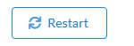
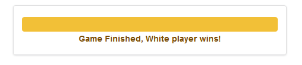

 

<h1>Reversi Game</h1>

A Reversi game implementation for technical test

 

  Frontend created by David Camilo Sanchez Mora for Heraclea

## Quick start

1. Clone this repo using `git clone`
2. Move to the appropriate directory: `cd game`. 
3. Run `yarn install` in order to install dependencies 
4. At this point you can run `npm start` to see the reversi game app at `http://localhost:3000`

## Components

### `<Game />`

  

### `Title and score components`

  

### `Restart game Button`

  

### `Game Status - Loading`

  

### `Game Status - Invalid movement`

  

### `Game Status - Successful movement`

  

### `Game Status - Game finished`

  

# Technology Stack

- [**React boilerplate**](https://github.com/react-boilerplate/react-boilerplate): A highly scalable, offline-first foundation with the best developer experience and a focus on performance and best practices.
- [**axios**](docs/general): A short overview of the included tools
- [**styled-components**](docs/general/commands.md): Getting the most out of this boilerplate
- [**Semantic-UI**](docs/testing): How to work with the built-in test harness
- [**react-animations**](docs/css): How to work with the CSS tooling